# Student Engagement Analytics API: find the students who are disengaging, before the withdrawal form does

[](https://github.com/Freddricklogan/student-engagement-api/actions/workflows/deploy.yml)
[](https://github.com/Freddricklogan/student-engagement-api/actions/workflows/deploy.yml)
[](https://github.com/Freddricklogan/student-engagement-api/actions/workflows/codeql.yml)
[](LICENSE)
[](#6-live-demo--production-showcase)

**[Portfolio](https://fredlogan.phd)** &nbsp;|&nbsp; **[All Projects](https://github.com/Freddricklogan)** &nbsp;|&nbsp; **[Security audit of the previous version](AUDIT.md)**

---

## 1. Executive Summary & Business Impact

### Problem statement

Institutions already collect every signal they need to spot a struggling student — LMS
page views, video watch time, quiz attempts, discussion posts, lab exercises — and then
leave it in a warehouse nobody queries until the term is over. By the time a withdrawal
lands on an advisor's desk, the pattern that predicted it has been sitting in the event
log for six weeks. The gap is not data collection; it is a **queryable, governed,
trustworthy interface** over the data that already exists.

The previous version of this service made that gap worse rather than better. It shipped a
hard-coded API key (`dev-api-key-2026`) that was also embedded in the dashboard JavaScript
served to every visitor, accepted that key in the query string where it lands in every
access log, and ran with Flask's interactive debugger enabled. Anyone who opened the
dashboard held full read **and write** access to the student record. Its 40-odd findings
are catalogued in **[AUDIT.md](AUDIT.md)**.

### Solution & value delivered

A production-grade, async FastAPI service over the same domain, rebuilt around three
commitments:

| Commitment | How it shows up |
|:--|:--|
| **Least privilege by default** | OAuth2 password grant issuing short-lived JWTs with verified issuer/audience claims, and three roles — `viewer` (read-only), `analyst` (read + write), `admin`. Every write endpoint is gated by a dependency; the public demo account cannot mutate a single row. |
| **Every failure is debuggable** | One centralized error path producing RFC 9457 `application/problem+json`. Every response — success or failure — carries an `X-Request-ID` that also appears in the structured JSON log line and in the problem document, so a screenshot from a user is enough to find the request. |
| **Engagement is a modelled concept, not a client-supplied float** | The old API stored whatever number a caller posted. Scoring is now a tested domain service: event-type weighting (60%), participation breadth (20%) and recency decay (20%), deterministic and inspectable at `/api/v1/analytics/students/{id}/score`. |

**No URL was broken.** `GET /` still serves the entry point, and every legacy `/api/*`
path resolves with a byte-identical response body. `/api/analytics/overview` is now an
alias for the canonical `/api/v1/analytics/summary`; a test asserts the two bodies match.

**Measured in this build:** 146 tests, **98% statement+branch coverage**, `ruff` clean,
`mypy --strict` clean across 45 source files, `bandit` clean, `pip-audit` reporting no
known vulnerabilities. Every number in this README was produced by a command in this
repository; nothing is estimated.

---

## 2. Demonstrated Competencies & Technical Skills

**Systems Architecture & CS**
Hexagonal (ports-and-adapters) layering — `domain` holds framework-free entities and
repository Protocols, `application` holds use cases and the scoring model, `adapters`
holds the SQLAlchemy repositories and FastAPI routers, `infrastructure` holds settings,
logging, security and the engine. Business rules are unit-testable with no HTTP layer and
no database. Async end to end (FastAPI + SQLAlchemy 2.0 async engine, session-per-request
via dependency injection). Pure-ASGI middleware rather than `BaseHTTPMiddleware`, chosen
deliberately: the latter runs the downstream app behind memory object streams, which
breaks exception propagation to the error handlers and leaks unclosed streams on the
failure path.

**Data Science & AI**
A defensible composite engagement score rather than a raw average: a weight-normalised
mean over event types (an assignment submission is worth 1.3, a page view 0.4), a breadth
term over distinct high-value participation types, and an exponential recency decay with a
14-day half-life. Twenty-seven tests cover the arithmetic, including hand-computed expected
values and the boundary of every score band. Aggregates are computed in SQL, not Python
loops, and `GROUP BY` lists every non-aggregated column so the queries are Postgres-legal
(the legacy `top_students` query was not).

**Cybersecurity & Compliance**
Threat-modelled refactor documented finding-by-finding in [AUDIT.md](AUDIT.md): credential
removed from source and from the browser bundle, query-string auth removed, bcrypt
(work factor 12) replacing string equality, RBAC enforced by composed dependencies, CORS
closed by default, rate limiting (global bucket plus a tighter bucket on the credential
endpoint), security response headers, a CSP on both HTML pages, and the dashboard's
`innerHTML` XSS sink replaced with `createElement`/`textContent`. Secrets come only from
the environment — `JWT_SECRET_KEY` has no production default and startup fails fast
without it. CI runs `bandit`, `pip-audit`, Trivy on the built image, and CodeQL weekly,
every job under an explicit least-privilege `permissions:` block.

**EdTech & Human-Centered Design**
The reviewer path is the design constraint. `GET /` offers two doors — **Open dashboard**
and **Open API explorer** — plus a one-click demo token. The dashboard runs a five-step
keyboard-accessible tour where every step performs a real API call, including one that
*attempts a write and shows you the 403*, so the access model is demonstrated rather than
described. The demo account is documented, read-only and requires no signup.

---

## 3. System Architecture & Data Flow

```mermaid
flowchart LR
    subgraph TB1["Trust Boundary: Public Internet"]
        BROWSER["Reviewer's browser<br/>landing · dashboard · Scalar"]:::client
        CLIENT["API client<br/>curl · LMS integration"]:::client
    end

    subgraph TB2["Trust Boundary: API Edge"]
        REQID["RequestContext middleware<br/>X-Request-ID mint/echo"]:::security
        SEC["Security headers<br/>nosniff · DENY · HSTS"]:::security
        CORS["CORS allow-list<br/>no wildcard origin"]:::security
        RATE["Rate limiter<br/>120/min · 10/min on /auth/token"]:::security
    end

    subgraph TB3["Trust Boundary: Application Core"]
        AUTHN["OAuth2 password grant<br/>bcrypt · JWT HS256"]:::security
        AUTHZ["RBAC dependency<br/>viewer · analyst · admin"]:::security
        VALID["Pydantic v2 models<br/>types · ranges · extra=forbid"]:::security
        ROUTERS["Routers<br/>/api/v1/* + legacy /api/* aliases"]:::service
        USECASE["Application services<br/>referential + duplicate rules"]:::service
        SCORE["Engagement scoring<br/>quality · breadth · recency"]:::service
        ERRORS["Problem handler<br/>RFC 9457 problem+json"]:::security
        LOGS["structlog JSON<br/>request_id · user · role"]:::service
    end

    subgraph TB4["Trust Boundary: Data"]
        REPOS["SQLAlchemy 2.0 repositories<br/>session-per-request"]:::service
        DB[("SQLite (aiosqlite)<br/>or Postgres (asyncpg)")]:::data
    end

    BROWSER -->|"HTTPS"| REQID
    CLIENT -->|"HTTPS"| REQID
    REQID --> SEC --> CORS --> RATE
    RATE -->|"POST /auth/token"| AUTHN
    RATE -->|"Bearer JWT"| AUTHZ
    AUTHN -->|"short-lived JWT<br/>iss · aud · exp verified"| BROWSER
    AUTHZ -->|"role checked<br/>before handler runs"| ROUTERS
    ROUTERS --> VALID --> USECASE
    USECASE --> SCORE
    USECASE -->|"domain entities only"| REPOS
    REPOS -->|"parameterized SQL<br/>FK pragma ON"| DB
    USECASE -.->|"DomainError"| ERRORS
    ERRORS -.->|"problem+json<br/>+ request_id, no traceback"| BROWSER
    ROUTERS -.-> LOGS
    AUTHZ -.-> LOGS

    classDef client fill:#1f2a44,stroke:#58A6FF,color:#e6edf3
    classDef service fill:#14213d,stroke:#3fb950,color:#e6edf3
    classDef data fill:#2b1d3a,stroke:#d2a8ff,color:#e6edf3
    classDef security fill:#3a1f1f,stroke:#f85149,color:#e6edf3
```



**Request path in one sentence:** a request enters with (or is given) a correlation id,
passes security headers, a closed CORS allow-list and a rate limiter, exchanges a bearer
token for a verified identity and role, is validated by a Pydantic model before any
handler runs, is executed by a service that owns the business rules, reaches the database
only through a repository that returns domain entities — and if anything fails, it leaves
as a problem document carrying the same correlation id that is in the server's logs.

### Data model

```
Student (1) ──< LearningSession (1) ──< EngagementEvent
User (auth, role: viewer | analyst | admin)
```

### Endpoints

| Method | Path | Role | Legacy alias |
|:--|:--|:--|:--|
| POST | `/api/v1/auth/token` | public | — |
| GET | `/api/v1/auth/me` | any | — |
| GET | `/api/v1/students` | any | `/api/students` |
| GET | `/api/v1/students/{id}` | any | `/api/students/{id}` |
| POST | `/api/v1/students` | analyst, admin | `/api/students` |
| GET | `/api/v1/sessions` | any | `/api/sessions` |
| POST | `/api/v1/sessions` | analyst, admin | `/api/sessions` |
| GET | `/api/v1/events` | any | `/api/events` |
| POST | `/api/v1/events` | analyst, admin | `/api/events` |
| GET | `/api/v1/analytics/summary` | any | `/api/analytics/overview` |
| GET | `/api/v1/analytics/sessions-by-course` | any | `/api/analytics/sessions-by-course` |
| GET | `/api/v1/analytics/engagement-trend` | any | `/api/analytics/engagement-trend` |
| GET | `/api/v1/analytics/top-students` | any | `/api/analytics/top-students` |
| GET | `/api/v1/analytics/students/{id}/score` | any | — |
| GET | `/health`, `/health/ready` | public | — |

---

## 4. Technical Highlights & Engineering Decisions

### ADR-1 — The legacy surface is an alias layer, not a second implementation

**Context.** A live dashboard and any existing integration call `/api/students`,
`/api/analytics/overview` and friends. Versioning the API under `/api/v1` is the right
long-term move, but a 301 to a renamed path would break every client that does not follow
redirects on POST, and maintaining two copies of each handler guarantees they drift.

**Decision.** `app/adapters/api/routers/legacy.py` re-declares every legacy route and
*calls the v1 handler function directly*, passing the same resolved dependencies. There is
exactly one implementation of every behaviour. The aliases carry
`include_in_schema=False`, so the OpenAPI document and the Scalar reference present one
clean, versioned surface while the compatibility layer stays invisible. `/api/docs`, which
used to serve a hand-maintained YAML file, is a 308 to the generated reference.

**Consequence.** Backwards compatibility costs ~50 lines and zero duplicated logic.
Parametrised tests assert that every legacy path returns a body identical to its v1
counterpart, and a dedicated test asserts the aliases enforce the *same* RBAC — a
compatibility shim that skipped an authorization check would be the obvious way to
reintroduce the vulnerability this refactor removed. The trade-off accepted: the aliases
are undocumented in the public schema, so they are a deprecation path, not a contract.

### ADR-2 — RBAC by dependency composition, not by decorator

**Context.** The legacy `@require_api_key` decorator conflated authentication and
authorization into one boolean and had no notion of a role. FastAPI offers three obvious
places to enforce access: a decorator, a router-level `dependencies=[...]`, or a parameter
dependency. Only one of them gives the handler the identity it just verified.

**Decision.** `require_roles(*allowed)` is a dependency *factory* returning a dependency
that itself depends on `get_current_user`. A route declares
`_user: RequireWriter` and gets authentication, authorization and the resolved `User`
object from one annotation. FastAPI resolves the chain before the handler body runs, so an
unauthorized request never reaches business logic, and the two failure modes stay distinct:
no token is `401` with `WWW-Authenticate: Bearer`, wrong role is `403` naming the roles
that would have worked.

**Consequence.** Adding a role is one enum member and one `Annotated` alias; there is no
per-route boilerplate and no way to forget the check on a new endpoint without the type
system showing an unused-dependency smell in review. The trade-off: slowapi's
`@limiter.limit` decorator could not be used alongside this, because it replaces the
endpoint with a `(*args, **kwargs)` wrapper that destroys the signature FastAPI
introspects — so the credential rate limit is also implemented as a dependency, built
directly on the `limits` library.

### ADR-3 — Correlation id in the outermost middleware, as pure ASGI

**Context.** The legacy app logged nothing an operator could use: a 500 seen by a user
could not be tied to any server-side line. Adding structured logging is easy; making the
id *survive the failure path* is the hard part, and that is exactly when it matters.

**Decision.** `RequestContextMiddleware` is the outermost middleware. It accepts a
client-supplied `X-Request-ID` (only when it is a plausible 8–128 characters, so an
attacker cannot inject arbitrary content into the log stream), otherwise mints a UUIDv4;
binds it to a `structlog` contextvar; writes it into the ASGI scope's `state`; and wraps
`send` so the header is attached to `http.response.start` regardless of which layer
produced the response. The centralized problem handlers read the same id back out and put
it in the `request_id` member of every problem document. It is written as **pure ASGI**
rather than `BaseHTTPMiddleware` because the latter runs the app in a task group behind
memory object streams — which swallowed exceptions before they reached the error handlers
and leaked unclosed streams on the failure path (both observed during this build).

**Consequence.** A user can screenshot a 403 and an operator can `grep` one id to find the
exact log line, with the authenticated username and role already bound to it. Six tests
cover the propagation, including that an implausible client-supplied id is replaced and
that an unhandled exception returns the correlation id and *no traceback*.

---

## 5. Getting Started & Verification

### Prerequisites

Python 3.12+, or Docker. Nothing else — SQLite is the default database and the demo data
generates itself on first start.

### Run locally in one command

```bash
git clone https://github.com/Freddricklogan/student-engagement-api.git
cd student-engagement-api
docker compose up --build          # http://localhost:8000
```

Or without Docker:

```bash
make install && make run           # http://localhost:8000
```

Either way, `DEMO_MODE=true` creates the schema, the three demo accounts and a
deterministic 40-student dataset at startup. Open <http://localhost:8000>.

To run against Postgres instead of SQLite — no code change, only `DATABASE_URL`:

```bash
make up-postgres                   # API on :8001, Postgres on :5432
```

### Verify it yourself

```bash
make check          # ruff + mypy --strict + pytest --cov + bandit + pip-audit
make test           # tests with a coverage report
make security       # bandit + pip-audit only
make seed ARGS=--reset   # regenerate the deterministic demo dataset
```

Smoke-test the running API:

```bash
curl -s localhost:8000/health

TOKEN=$(curl -s -X POST localhost:8000/api/v1/auth/token \
  -d 'username=demo&password=demo-viewer-2026' | python3 -c 'import json,sys;print(json.load(sys.stdin)["access_token"])')

curl -s -H "Authorization: Bearer $TOKEN" localhost:8000/api/v1/analytics/summary

# The demo token is read-only — this returns 403 as problem+json:
curl -s -X POST -H "Authorization: Bearer $TOKEN" -H 'Content-Type: application/json' \
  -d '{"student_id":"STU00000","first_name":"A","last_name":"B","email":"a.b@example.edu"}' \
  localhost:8000/api/v1/students
```

### Results measured in this build

| Check | Command | Result |
|:--|:--|:--|
| Tests | `pytest` | **146 passed** |
| Coverage | `pytest --cov` | **98%** (statement + branch, `app/`) |
| Lint | `ruff check` + `ruff format --check` | clean |
| Types | `mypy --strict` | clean, 45 source files |
| Code security | `bandit -r app scripts` | 0 findings |
| Dependency CVEs | `pip-audit -r requirements.txt --strict` | no known vulnerabilities |

CI enforces `--cov-fail-under=85` so the number cannot silently regress.

---

## 6. Live Demo & Production Showcase

### Deploy in one click

No live URL is claimed here, because none has been provisioned. Both blueprints are
committed and a demo URL is one click away:

* **Render** — dashboard → *New* → *Blueprint* → point at this repo. [`render.yaml`](render.yaml)
  defines the Docker web service, the `/health` check, a 1 GB disk for the SQLite database
  and a generated `JWT_SECRET_KEY`.
* **Fly.io** — `fly launch --copy-config --now`. [`fly.toml`](fly.toml) defines the same
  shape with a persistent volume and scale-to-zero.
* **Any container host** — CI publishes the image to
  `ghcr.io/Freddricklogan/student-engagement-api:latest` on every push to `main`, after it
  passes a Trivy scan.

Both blueprints ship with `DEMO_MODE=true` so the deployed URL is immediately useful with
no signup. Turn it off and set a real `JWT_SECRET_KEY` for anything beyond a showcase.

### Demo credentials

| Username | Password | Role | Can write? |
|:--|:--|:--|:--|
| `demo` | `demo-viewer-2026` | `viewer` | **No** — every write returns `403` problem+json |
| `analyst` | `analyst-demo-2026` | `analyst` | Yes |
| `admin` | `admin-demo-2026` | `admin` | Yes |

These are deliberately public demo logins, not secrets. They exist only while
`DEMO_MODE=true`, and all three are overridable from the environment.

### 30-second guided walkthrough for reviewers

1. **Open `/`.** The KPI strip is live — those five numbers come from
   `GET /api/v1/analytics/summary` on page load, computed in SQL from the seeded dataset.
2. **Click "Mint a demo token", then "Copy token".** The page performs a real OAuth2
   password grant. Note what it does *not* do: there is no API key in the JavaScript, and
   the JWT is held in memory only — never in `localStorage`, never in a URL.
3. **Click "Open API explorer".** Scalar loads with the generated OpenAPI document
   preloaded. Paste the token into **Authorize** and run
   `GET /api/v1/analytics/summary` — the numbers match step 1.
4. **Run `POST /api/v1/students` with the same token.** You get `403` as an RFC 9457
   `application/problem+json` document naming the roles that would have worked, with a
   `request_id` that matches the `X-Request-ID` response header.
5. **Open `/dashboard` and press "Take the 30-second tour".** Five keyboard-accessible
   steps (Esc closes, arrows step), each performing a real API call — the last one runs the
   write from step 4 and renders the denial in the page.

---

## License

MIT — see [LICENSE](LICENSE).

## Author

**Freddrick Logan**
[GitHub](https://github.com/Freddricklogan) · [LinkedIn](https://www.linkedin.com/in/freddricklogan/) · [fredlogan.phd](https://fredlogan.phd)
